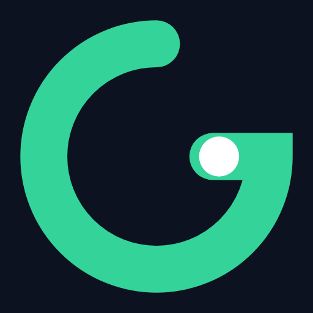
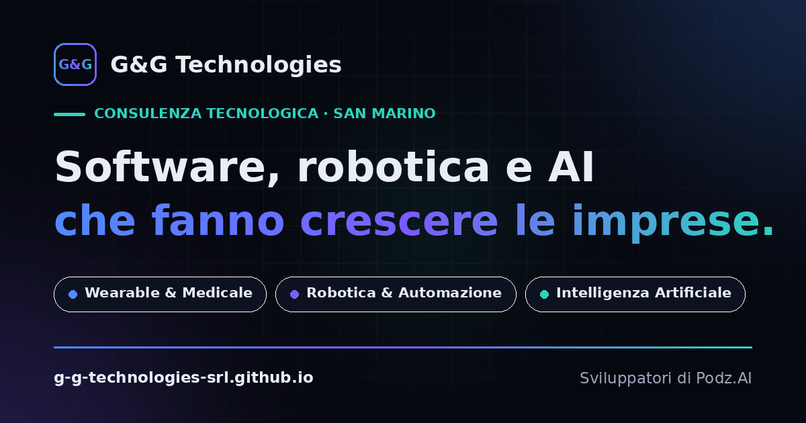

<picture>
  <source media="(prefers-color-scheme: dark)" srcset="assets/apple-touch-icon.png">
  
</picture>

# G&G Technologies

**Software, robotica e AI che fanno crescere le imprese.**
*Software, robotics and AI that make businesses grow.*

---

## Chi siamo

**G&G Technologies Srl** è una società di consulenza tecnologica con sede nella Repubblica di San Marino. Il team unisce programmatori esperti, architetti software e sistemisti, con oltre 30 anni di attività nel mondo dell'informatica e dell'innovazione: processi di vendita digitalizzati, decine di fabbriche automatizzate e soluzioni wearable per il monitoraggio biovitale in ambito medicale e sportivo.

Dal nostro percorso di ricerca — il progetto **DigiSense** — è nato [**Podz.AI**](https://g-g-technologies-srl.github.io/digisense-releases/), la workstation AI personale.

Lavoriamo al fianco di imprenditori e professionisti: prima capiamo il processo, poi scegliamo la tecnologia. Mai il contrario.

## Cosa facciamo

| Area | Competenze |
|---|---|
| **Wearable & Medicale** | Elettronica custom, firmware, piattaforme di telemonitoraggio e big data biovitali per atleti, pazienti e anziani |
| **Robotica & Automazione** | Automazione bordo macchina, integrazione con sistemi embedded, efficientamento dei processi verso l'Industria 5.0 |
| **Intelligenza Artificiale** | Agenti AI e specialisti verticali, AI locale e privacy by design, analisi e trasformazione dati |

Settori in cui abbiamo lavorato: sanità, sport, manifattura, rete vendita.

## Podz.AI

> **La tua AI. Sul tuo computer. Con i tuoi dati al sicuro.**

Un'unica applicazione che installi sul tuo computer e che lavora con i tuoi documenti, senza mandare i dati a nessuno. Il cloud è una scelta, non il default: modelli locali privati, Anonimizzatore integrato e specialisti — legale, ricerca web, screening CV — che si installano con un clic.

Prova gratuita di 30 giorni al primo avvio · Windows, macOS e Linux · Made in EU

**[Scarica Podz.AI](https://g-g-technologies-srl.github.io/digisense-releases/download.html)** · [Sito ufficiale](https://g-g-technologies-srl.github.io/digisense-releases/) · [Release](https://github.com/G-G-Technologies-Srl/digisense-releases/releases)

## Questo repository

Il sito aziendale, servito da GitHub Pages su [g-g-technologies-srl.github.io](https://g-g-technologies-srl.github.io/). Una single-page application costruita come scriviamo il software per i nostri clienti: essenziale, misurabile, rispettosa di chi la usa.

- **Un solo file HTML** — niente framework, niente build, niente dipendenze
- **Zero cookie, zero tracker, zero richieste a terze parti** — anche i font sono di sistema
- **Bilingue** italiano/inglese con rilevamento automatico della lingua
- **Tema chiaro e scuro** con preferenza persistente e rispetto di `prefers-color-scheme`
- **Accessibile** — contrasti WCAG AA verificati, navigazione da tastiera, skip-link, `prefers-reduced-motion`
- **SEO completa** — Open Graph, Twitter card, JSON-LD (Organization + WebSite), sitemap e robots

  

<strong>English</strong>

 

**G&G Technologies Srl** is a technology consulting company based in the Republic of San Marino: over 30 years in software and innovation, dozens of automated factories, and wearable solutions for biovital monitoring in healthcare and sport. Our research journey — the **DigiSense** project — led to [**Podz.AI**](https://g-g-technologies-srl.github.io/digisense-releases/), the personal AI workstation: a single application that works with your documents on your computer, without sending your data to anyone.

We work in three areas: **medical wearables** (custom electronics, firmware, remote-monitoring platforms), **robotics & automation** (edge integration, Industry 5.0), and **artificial intelligence** (AI agents, local AI, privacy by design).

This repository hosts the company website — a single dependency-free HTML file: no cookies, no trackers, no third-party requests, bilingual IT/EN, light/dark theme, WCAG AA contrast, full SEO markup.

## Contatti

**G&G Technologies Srl**
Via Marino Moretti, 23 — 47899 Serravalle, Repubblica di San Marino
[info@ggtechnologies.sm](mailto:info@ggtechnologies.sm) · +378 0549 900824 · [LinkedIn](https://www.linkedin.com/company/gg-technologies-srl)

---

© G&G Technologies Srl · C.O.E./VAT SM29141 · DigiSense® è un marchio registrato.

