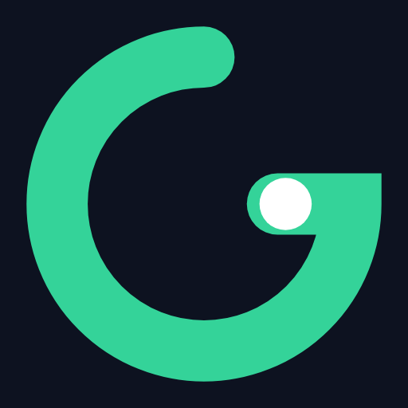
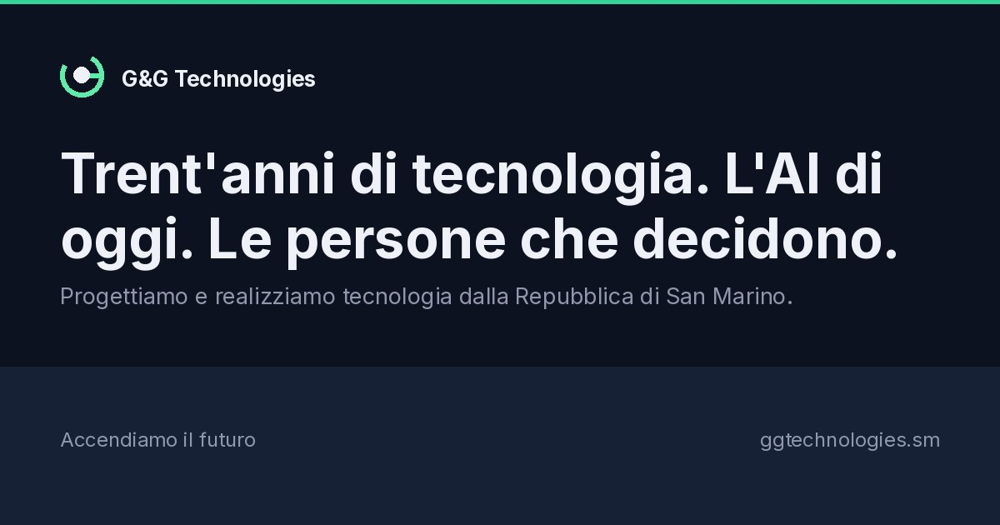

<div align="center">

<picture>
  <source media="(prefers-color-scheme: dark)" srcset="assets/apple-touch-icon.png">
  
</picture>

# G&G Technologies

**Accendiamo il futuro** · *Powering the future*

Wearable medicali, robotica industriale e intelligenza artificiale.
Progettati e realizzati nella Repubblica di San Marino.

[](https://ggtechnologies.sm/)
[](https://ggtechnologies.sm/digisense-releases/download.html)
[](https://www.linkedin.com/company/gg-technologies-srl)
[](mailto:info@ggtechnologies.sm)

</div>

---

## Chi siamo

**G&G Technologies Srl** progetta e realizza tecnologia dalla Repubblica di San Marino. Alla guida
c'è Gian Angelo Geminiani, che fa questo mestiere dal 1997. Attorno, una rete di collaboratori e
partner tecnologici in più paesi: architetti software, progettisti elettronici, sistemisti, scelti
in base al progetto.

Tutto poggia su **DigiSense®**, il nostro framework registrato: acquisizione dei dati, esecuzione
dei modelli e controllo macchina, risolti una volta e riusati su ogni progetto. Su quel framework è
costruito [**Podz.AI**](https://ggtechnologies.sm/podz-ai/), la workstation AI personale.

Il lavoro sui wearable è entrato in uno studio con revisione paritaria pubblicato su «Sensors» nel
2024, firmato con il CNR e quattro università: novecento operatori dell'emergenza seguiti per dodici
mesi — [DOI 10.3390/s24216992](https://doi.org/10.3390/s24216992).

Prima capiamo il processo, poi scegliamo la tecnologia. Mai il contrario.

## Cosa facciamo

| Area | Competenze |
|---|---|
| [**Wearable medicali**](https://ggtechnologies.sm/servizi/wearable-medicale/) | Elettronica custom, firmware a basso consumo, piattaforme di telemonitoraggio, elaborazione dei segnali fisiologici |
| [**Robotica & Automazione**](https://ggtechnologies.sm/servizi/robotica-automazione/) | Automazione bordo macchina, integrazione con i gestionali in uso, misura di fermi e scarti |
| [**Intelligenza Artificiale**](https://ggtechnologies.sm/servizi/intelligenza-artificiale/) | Agenti costruiti su un compito preciso, ricerca semantica sui documenti, integrazione nei processi esistenti |
| [**AI on-premise**](https://ggtechnologies.sm/servizi/ai-on-premise/) | Modelli che girano sui tuoi server, anonimizzazione prima del cloud, i documenti non lasciano l'infrastruttura |

Settori in cui abbiamo lavorato: sanità, sport, manifattura, rete vendita.

In sviluppo: un [robot per l'assistenza domiciliare](https://ggtechnologies.sm/progetti/robot-assistenza-domiciliare/)
su base Reachy Mini, con il modello che gira a bordo e i dati che non escono di casa. È un prototipo,
non un prodotto in vendita.

## Podz.AI

> **La tua AI. Sul tuo computer. Con i tuoi dati al sicuro.**

Un'unica applicazione che si installa sul computer e lavora con i tuoi documenti sulla tua macchina.
Il cloud è una scelta, non il default: modelli locali, anonimizzazione integrata e specialisti —
legale, ricerca web, screening CV — che si installano con un clic.

Prova gratuita di 30 giorni al primo avvio · Windows, macOS e Linux · sviluppato in Europa

**[Scarica Podz.AI](https://ggtechnologies.sm/digisense-releases/download.html)** ·
[Sito ufficiale](https://ggtechnologies.sm/digisense-releases/) ·
[Release](https://github.com/G-G-Technologies-Srl/digisense-releases/releases)

## Questo repository

Il sito aziendale, servito da GitHub Pages su [ggtechnologies.sm](https://ggtechnologies.sm/).
Trenta pagine statiche generate da un build in Python, costruite come scriviamo il software per chi
ci commissiona un progetto: essenziali, verificabili, rispettose di chi le usa.

- **Nessuna dipendenza a runtime** — niente framework, niente bundler, niente `node_modules`
- **Zero cookie, zero tracker, zero richieste a terze parti** — anche i caratteri sono quelli di sistema
- **Bilingue** italiano e inglese, con un URL per lingua e `hreflang` reciproci
- **Tema chiaro e scuro** con preferenza persistente e rispetto di `prefers-color-scheme`
- **Accessibile** — contrasti WCAG AA, navigazione da tastiera, skip-link, `prefers-reduced-motion`
- **Dati strutturati** — `Organization`, `WebSite`, `Service`, `SoftwareApplication`, `AboutPage`,
  `FAQPage`, `BreadcrumbList`, `ScholarlyArticle`, più sitemap e `robots.txt`

### Come si costruisce

Serve Python 3 e nient'altro. Le pagine sono generate: non si modificano a mano.

```bash
python3 _src/build.py        # genera le pagine, la sitemap e i due asset
python3 _src/check_site.py   # deve stampare OK prima di pubblicare
python3 -m http.server 8000  # anteprima su http://localhost:8000
```

Il build si ferma con un errore esplicito invece di produrre pagine sbagliate in silenzio: controlla
che le due lingue non divergano, che i prezzi coincidano con il listino del sito di prodotto e che
ogni articolo abbia la sua illustrazione e la sua card social.

<div align="center">
  
</div>

<details>
<summary><strong>English</strong></summary>

<br>

**G&G Technologies Srl** designs and builds technology from the Republic of San Marino. It is led by
Gian Angelo Geminiani, who has worked in this trade since 1997, with a network of collaborators and
technology partners across several countries.

Everything sits on **DigiSense®**, our registered framework: data acquisition, running the models
and machine control, solved once and reused on every project. [**Podz.AI**](https://ggtechnologies.sm/en/podz-ai/),
the personal AI workstation, is built on it.

We work in four areas: **medical wearables** (custom electronics, firmware, remote vital-signs
monitoring platforms), **robotics & automation** (automation at the machine, integration with the
systems you already run), **artificial intelligence** (agents built for one defined job, semantic
search over your documents) and **on-premise AI** (models that run on your own servers, so the
documents never leave your infrastructure).

The wearable work went into a peer-reviewed study published in “Sensors” in 2024, written with the
Italian National Research Council and four universities: nine hundred emergency workers followed for
twelve months — [DOI 10.3390/s24216992](https://doi.org/10.3390/s24216992).

This repository holds the company website: thirty static pages generated by a Python build. No
runtime dependencies, no cookies, no trackers, no third-party requests, bilingual IT/EN with one URL
per language, light and dark themes, WCAG AA contrast, and full structured-data markup.

</details>

## Contatti

**G&G Technologies Srl**
Via Marino Moretti, 23 — 47899 Serravalle, Repubblica di San Marino
[info@ggtechnologies.sm](mailto:info@ggtechnologies.sm) · +378 0549 900824 ·
[LinkedIn](https://www.linkedin.com/company/gg-technologies-srl)

Risponde una persona del team, non un form, entro un giorno lavorativo.

---

<div align="center">
<sub>© G&G Technologies Srl · C.O.E./VAT SM29141 · DigiSense® è un marchio registrato.</sub>
</div>
